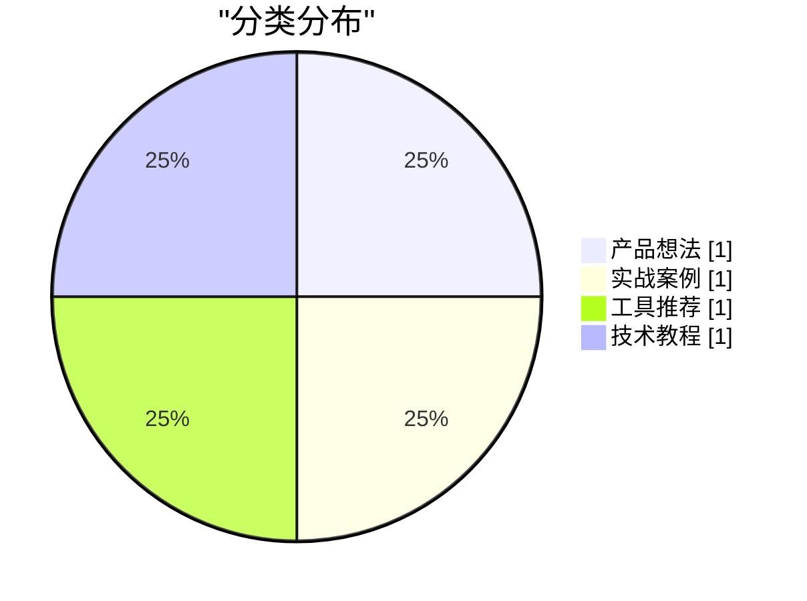

# 素材日报 · 2026-03-25

## 今天哪些值得写

**从零搭建 Agent 工作流** ★★★★
围绕提示词、状态管理和观测三件事，讲清楚长链路 Agent 工作流的工程化边界
→ [[2026-03-25 从零搭建 Agent 工作流]]

---

## 📊 当天收藏总览

---

## 全量收藏清单

### 产品想法

#### 面向创作者的素材中台
**来源**: 创意会  **星级**: ★★
**摘要**: 把多平台素材先标准化再分发，减少重复整理成本并提高复用率。

**关键内容**:
- 把多平台素材先标准化再分发，减少重复整理成本并提高复用率
- 正文：统一索引、标签治理和多终端检索体验

→ [[2026-03-25 面向创作者的素材中台]]

### 实战案例

#### 自动化摘要系统复盘
**来源**: 团队内部  **星级**: ★★★
**摘要**: 记录从采集到发布的完整链路，重点是失败重试与幂等写入策略。

**关键内容**:
- 记录从采集到发布的完整链路，重点是失败重试与幂等写入策略
- 正文：错误注入实验、重跑结果和耗时对比

→ [[2026-03-25 自动化摘要系统复盘]]

### 工具推荐

#### Cursor Rules 最佳实践
**来源**: Latent Space  **星级**: ★★
**摘要**: 总结了在团队内推广 Cursor Rules 的四个落地动作，重点是如何把规则模板做成可复用资产。

**关键内容**:
- 总结了在团队内推广 Cursor Rules 的四个落地动作，重点是如何把规则模板做成可复用资产
- 正文：规则分层、模板管理、团队协作注意事项

→ [[2026-03-25 Cursor Rules 最佳实践]]

### 技术教程

#### 从零搭建 Agent 工作流
**来源**: OpenAI Docs  **星级**: ★★★★
**摘要**: 围绕提示词、状态管理和观测三件事，讲清楚长链路 Agent 工作流的工程化边界。

**关键内容**:
- 围绕提示词、状态管理和观测三件事，讲清楚长链路 Agent 工作流的工程化边界
- 正文：分阶段拆解工作流、观测指标和回滚策略

→ [[2026-03-25 从零搭建 Agent 工作流]]
